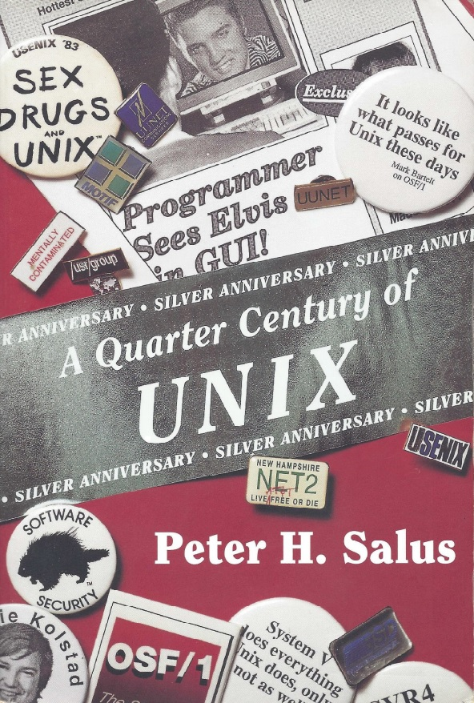

# UNIX二十五年 -- A Quarter Century of UNIX 翻译

|  |
| :-: |

UNIX是一个简洁，优雅，可移植，以及能力非常强大的软件系统，它没有借助于商业市场就变得非常流行。程序员们使用它，大的商业公司们却在抵制它。十年后，用户们取得了令人难以置信的胜利。`A Quarter Century of UNIX` 是第一本由亲历者讲述这段历史的书。开发者和用户们描绘了技术社区是如何战胜了数百万美元的商业公司。准备写这本书时，Peter Salus访问了一百多位关键人物，并为了搜集相关信息从澳大利亚走到了奥地利。本书搜集流传各地的UNIX故事汇编成为详尽的UNIX历史。

**特点**

> * 提供了文档化的UNIX系统开发历史
> * 包含一百多位UNIX社区关键人物的访谈
> * 收录了珍贵的照片和图片
> * 详细讲解为什么UNIX可以取得成功

**关于作者**

> Peter H.Salus是一位获得广泛认可的UNIX爱好者，是季刊《计算机系统》的主编。他定期为USENIX的杂志《;login:》撰写专栏《书虫》。他也是一系列图书，文章以及访谈的作者。Salus拥有化学专业学位，德语学位，以及纽约大学的一个语言学博士学位。

---
**译者注**

* 本书由Addison-Wesley出版社于1994年出版
* 在线阅读：https://zhangyangjing.gitbooks.io/a-quarter-century-of-unix-zh/content/
* 翻译源码：https://github.com/zhangyangjing/A-Quarter-Century-of-UNIX-zh
* 英文原版：http://wiki.tuhs.org/lib/exe/fetch.php?media=publications:qcu.pdf
* Unix源码：http://minnie.tuhs.org/cgi-bin/utree.pl
